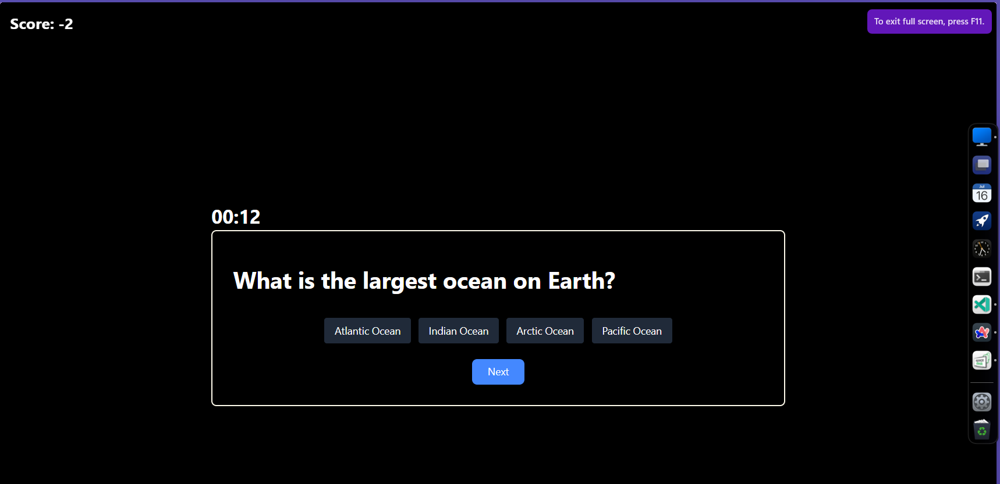

# Quiz App

A simple, card-based multiple-choice quiz app with instant visual feedback, score tracking, and an optional countdown timer.

## Features

- **Intro screen** — a short description of the quiz and a Start button
- **Card-based questions** — one multiple-choice question shown at a time
- **Instant feedback** — selected answer is highlighted, correct answer turns green, incorrect turns red, and the correct answer is revealed
- **Score tracking** — score increases by 1 for each correct answer
- **Results screen** — final score plus a full summary of how each question was answered
- **Optional timer** — 1-minute countdown per question; if time runs out, the app auto-advances and deducts 1 point

## How It Works

1. User lands on the intro screen and clicks **Start**
2. The first question appears in a card with answer buttons
3. User selects an answer:
   - The button they picked is highlighted
   - Correct answer turns green, wrong answer turns red
   - If a timer is enabled and expires, the app moves on automatically and subtracts a point
4. Once all questions are answered, a final results screen shows:
   - Total score
   - A breakdown of every question, the answer chosen, and whether it was correct

## Tech Stack

- React
- Vite
- Tailwind CSS

*(Update this section to match your actual stack if different.)*

## Screenshots



## Getting Started

```bash
# Clone the repo
git clone https://github.com/WorldRuler-sai/quiz.git
cd quiz

# Install dependencies
npm install

# Run the dev server
npm run dev
```

## Project Structure

```
quiz/
├── public/
├── src/
│   ├── components/
│   │   ├── Card.jsx
│   │   └── Timer.jsx
│   ├── App.css
│   ├── App.jsx
│   ├── index.css
│   └── main.jsx
├── .gitignore
├── .oxlintrc.json
├── index.html
├── package.json
├── package-lock.json
├── README.md
└── vite.config.js
```

## Adding Questions

Questions are stored in a simple array/object format with a prompt, answer options, and the correct answer index. Add new entries to the questions data file to expand the quiz.

## Roadmap / Ideas

- Categories/difficulty selection
- Persist high scores
- Shuffle questions and answers
- Share results

## License

MIT